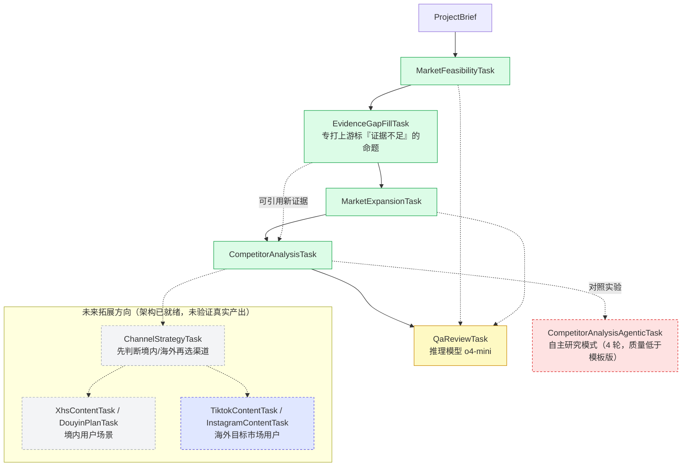

# 系统设计说明

## 设计目标

两条线并重：

1. **产出线**：以「可行性 → 缺口补证 → 开拓 → 竞品」的 SOP 组织多 Agent 协作，输出可追溯的进入研究
2. **评估线**：因为实测发现提示词里写了规则模型也经常不遵守，配了一套**不依赖模型自评**的机械校验 + 工具调用审计（见下方「三层验证体系」）

第二条线后来成了项目重心——详见 [`docs/findings.md`](findings.md)。

## V1 范围 vs 未来拓展方向

- **V1 核心（已验证，默认跑的）**：`market_feasibility_task` → `evidence_gap_fill_task` → `market_expansion_task` → `competitor_analysis_task`。默认 `--variant research_only` 就是这四步。
  三个案例：`outputs/花知晓/backup_v4/`（主演示，已冻结）、`outputs/东边野兽/backup_v8/`（对照基线，已冻结）、`outputs/石头科技/v1/`（跨行业首测，**未冻结**，仍有已知问题）。
- **QA 审校（已验证可用，有明确盲区）**：`--variant research_qa`。已在推理模型 `o4-mini` 下验证能发现机械校验查不到的问题（引用无出处、与 brief 原文不符）；在 `gpt-4o-mini` 下会误报并自相矛盾。**已知盲区**：只核对已存在的引用，不查「本该有引用却空着」的位置（已加模板补丁并用 benchmark 验证生效）。
- **agentic 竞品分析（试过、有数据、不主推）**：`--variant competitor_agentic`。跑了 4 轮，产出质量稳定低于模板版；保留为对照分支，见 `outputs/东边野兽/agentic_v2/`。
- **未来拓展方向（架构已预留，未验证）**：`channel_strategy_task`，以及内容生产（境内 `xhs_content_task`/`douyin_plan_task`；海外 `tiktok_content_task`/`instagram_content_task`）。代码没删，但没跑出过真实样本，不当成品讲。

## 架构总览



**图例**：绿色 = V1 核心，已验证、有冻结产物｜黄色 = 已验证可用但有已知盲区｜
红色虚线 = 试过并保留的失败对照分支｜灰色虚线 = 架构已就绪但未验证｜蓝色虚线 = 海外渠道分支
（修复了"内容生产只配小红书/抖音、触达境内用户"与出海定位不符的问题，见下方"海外内容渠道"一节）。

## 三层验证体系

| 层 | 实现 | 覆盖率 | 强项 | 弱项 |
|---|---|---|---|---|
| **机械校验** | `src/marketing_crew/citation_check.py`（18 类检测，纯标准库） | 100%，每行都查 | 零边际成本、结果稳定可复算 | 只认写进代码的模式 |
| **QA 审校** | `qa_review_task` + 推理模型 | 不保证 | 能发现工具没被教过的问题（回查 brief 原文） | 不稳定，需 benchmark 量化 |
| **人工通读** | — | 取决于注意力 | 判断力最强，是新规则的唯一来源 | 不可规模化、注意力不稳定 |

**关键设计原则**：人工的产出不是「这一版有什么问题」，而是「从此每一版都自动查这个问题」。
现有 18 类检测每一条都来自一次人工发现。反例：某条 Aesop 商品页 URL 路径与产品品类矛盾的问题，
在 v4.1 发现后只写进了 changelog、没编码成规则，结果连续在 v5–v8 出现了五个版本无人拦截，
直到做成「SKU 名与 URL 品类矛盾」检测才被永久拦住。

**配套工具**（详见根 `README.md` 的「评估体系」节）：

- `experiments/rule_compliance_matrix.py` —— 跨 33 个归档版本 × 18 类检测的矩阵，含问题密度
- `experiments/qa_bench.py` + `qa_bench_cases.yaml` —— QA 召回率 benchmark，18 条人工标注的已知问题，支持 `--repeat` 看稳定性
- `src/marketing_crew/tool_audit.py` —— 订阅 CrewAI 事件总线，记录每次**真实**工具调用
- `experiments/verify_urls.py` / `verify_claims.py` —— URL 存活性验证 / 「已核实」声明与审计日志对质

## 市场研究两阶段（避免每轮重来）

| 阶段 | Task | 输出 | 问题 |
|------|------|------|------|
| 1 | `market_feasibility_task` | `market_feasibility.md` | 要不要进入？ |
| 2 | `market_expansion_task` | `market_expansion.md` | 如何开拓？ |

`market_expansion_task` 通过 CrewAI `context` 承接可行性结论，禁止重复论证「要不要进入」。

分次运行：

```bash
# 第一轮：只判断可行性
PYTHONPATH=. python -m src.marketing_crew.main --variant feasibility_only ...

# 第二轮：在可行性基础上做开拓（自动带上游 feasibility task）
PYTHONPATH=. python -m src.marketing_crew.main --variant expansion_only ...

# 或一次跑完研究链
PYTHONPATH=. python -m src.marketing_crew.main --variant research_only ...
```

## 模块拆分

- `src/marketing_crew/config/agents.yaml`
  - 定义角色、目标、工具绑定
- `src/marketing_crew/config/tasks.yaml`
  - 流水线清单（`task_order`）；各 task 正文在 `tasks/*.yaml`
- `src/marketing_crew/crew.py`
  - 读取配置并动态构建 Agent 与 Task
  - 支持 variant 与 `--tasks`（自动展开上游 context 依赖）
- `knowledge/registry.yaml` + `knowledge/core/*` + `knowledge/markets/*`
  - 研究链路按 `market_scope` 自动映射市场知识包
- `knowledge/*.md`（legacy，境内内容链路）
  - 小红书（`xiaohongshu_rules.md`）、抖音（`douyin_performance_rules.md`）暂沿用显式文件引用，
    面向境内用户场景
- `knowledge/*.md`（海外内容链路，新增）
  - TikTok（`tiktok_rules.md`）、Instagram（`instagram_rules.md`）、Reddit（`reddit_rules.md`，
    定位是研究信源而非内容渠道，文件里写了判断依据）——面向出海目标市场本地用户，
    见下方"海外内容渠道"一节

## 与 MetaGPT 理论的映射

虽然实现框架为 CrewAI，但设计借鉴 MetaGPT 的核心思想：

1. SOP 驱动的角色分工：任务链条按业务流程拆分，避免单 Agent 跳步。
2. 结构化协作：上游任务输出作为下游任务上下文，减少信息漂移。
3. 反馈闭环（设计已预留，属于未来拓展方向）：Brand QA 节点设计为上线前统一审校，
   目前还没有真实运行验证过，V1 阶段的"反馈闭环"实际靠的是这次新加的代码级引用校验。

## 模板化策略

本项目通过配置化实现可复用：

- 角色与任务均在 YAML 中定义
- 统一 `ProjectBrief` 输入协议
- 研究与内容子链路可独立运行（见 `build_research_crew` / `build_content_crew`）

## 引用校验（事后把关，不依赖模型自评）

prompt 里写了大量"禁止 example.com / 禁止拿首页当证据 / 禁止空引用"的硬规则，
但历史输出证明模型会不遵守（`outputs/backup_v3` 里就有 `https://www.example.com`
被标成 A 级证据、Statista 首页被当市场规模来源）。QA agent 本身也可能漏检，
所以加了一层不依赖 LLM 判断的机械校验：

- `src/marketing_crew/citation_check.py`：扫描输出文件里的每个 URL，标记占位域名
  （example.com 等）、机构首页当证据、参考文献表未填的模板占位符。
- `main.py` 跑完 `crew.kickoff()` 后自动打印一份校验报告；加 `--strict-citations`
  可以让发现严重问题时以非零退出码结束。
- `experiments/validate_citations.py`：不重新跑 crew，单独对已有 `outputs/*.md` 做校验。
- `experiments/evaluate_outputs.py` 的 `traceability_score` 不再只数 `https://`
  出现次数，会先扣掉被判定为假引用的部分（新增 `fake_citation_count` /
  `citation_validity_score` 字段）。

这一步是硬校验，抓不到"证据是否真的支持结论"这种语义问题——那部分还是靠
`qa_review_task`（已改成逐条机械核对 URL/门槛表状态值的清单式审校）和人工复核。

## 海外内容渠道（未来拓展方向，修复了渠道选型 bug）

内容生产这一步原来只配了小红书/抖音（`xhs_content_task`/`douyin_plan_task`），但这两个是中国大陆平台，
触达境内用户，跟"帮中国品牌研究出海到英国/东南亚等市场"这个项目定位对不上——brief 示例
（`briefs/herbeast_uk_v2.json`）的目标受众是"25-40 岁英国都市女性"，不是境内用户。

修复方式（纯新增，没有删除或覆盖任何现有代码）：

- `config/tasks/tiktok_content.yaml`、`instagram_content.yaml` + `agents.yaml` 里新增的
  `tiktok_content_planner`/`instagram_content_strategist`：面向目标市场本地用户，
  knowledge 分别接 `tiktok_rules.md`/`instagram_rules.md`。
- 两个新 task **没有加进 `task_order`**，不会被任何默认 `--variant` 带入，只能用
  `--tasks tiktok_content_task`（或 `instagram_content_task`）显式调用，会自动展开上游依赖
  （可行性 → 开拓 → 竞品 → 渠道策略）——用一个独立测试脚本验证过依赖展开顺序、`{brief}`
  占位符替换、知识包注入这三件事都是对的。
- `channel_strategy_task` 的 description 加了一条硬规则：先判断 brief 的
  `market_scope`/`target_audience` 是境内用户还是目标市场本地用户，再选对应渠道组合
  （小红书+抖音，或 TikTok+Instagram+Reddit 研究信源），不再默认小红书/抖音。
- 原有的 `xhs_content_task`/`douyin_plan_task` 完全没动，作为"境内用户"场景继续存在。

**还没做的**：这些新 task 没有跑出过真实产出样本，模型会不会真的按"先判断境内/海外"这条规则走、
TikTok/Instagram 内容质量如何，都还是未知数——跟其它未来拓展方向的状态一致，不因为架构补齐了
就代表这条方向已经可以拿出来当成品讲。
